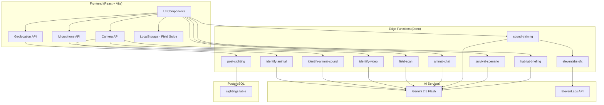

# StrangerDanger — AI Wildlife Safety & Conservation

**AI-powered wildlife identification and safety companion for the modern explorer.**

Built for hackathon — covers **multi-device hardware**, **AI/ML**, and **conservation** tracks.

## Features

| Feature | Description |
|---------|-------------|
| **Photo ID** | Upload a photo → instant AI species identification with threat level, conservation status, and habitat info |
| **Sound ID** | Record or upload animal sounds → AI identifies the species from audio |
| **Video ID** | Upload video → extracts frames + audio for combined multimodal identification |
| **Live Camera** | Real-time camera feed with on-demand AI identification |
| **Animal Chat** | Follow-up Q&A with AI about any identified animal (behavior, safety tips, fun facts) |
| **AR Field Scanner** | Point your camera at the environment → AI labels every animal and plant in frame |
| **Sound Training** | Interactive quiz — listen to AI-generated animal sounds and test your identification skills |
| **Survival Simulator** | AI-generated wildlife encounter scenarios — choose your response and get scored |
| **Learn Before You Go** | Enter a destination → get an AI habitat briefing on local wildlife dangers |
| **Nearby Feed** | Map of recent community sightings with geolocation |
| **Field Guide (Pokédex)** | Personal collection of all animals and plants you've identified |
| **Plant Identification** | Save and categorize plants from the Field Scanner with edibility/toxicity info |

## Tech Stack

- **Frontend:** React 18, TypeScript, Vite, Tailwind CSS, Framer Motion
- **Backend:** Lovable Cloud (Supabase) — Edge Functions, PostgreSQL, Realtime
- **AI Models:** Google Gemini 2.5 Flash (vision + text + audio)
- **Audio SFX:** ElevenLabs API (sound training)
- **Geolocation:** Browser Geolocation API
- **Camera:** MediaDevices API (getUserMedia)

## How It Works

1. **Spot** — See or hear a wild animal
2. **Scan** — Upload a photo, sound, video, or use the live camera
3. **Learn** — Get instant AI identification with safety info and conservation status
4. **Save** — Animal/plant added to your personal Field Guide
5. **Share** — Sighting posted to the community Nearby Feed with geolocation

## Architecture



## 🚀 Getting Started

```bash
npm install
npm run dev
```
